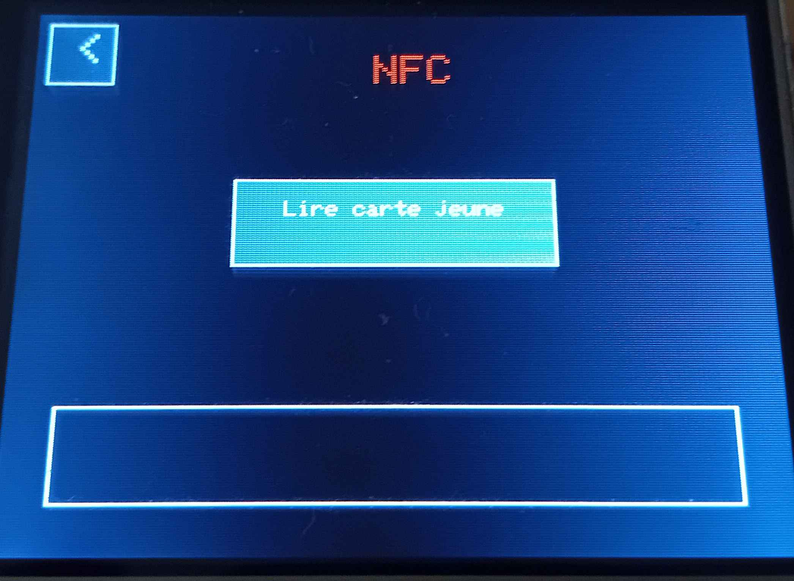

# QTGlider
A school project, utilizing 2 Arduinos with the aim of being able to showcase basic "hacking" functionalities.

## Features
- Read the uid of a youth card.
- Scan all available wifi
- Create fake wifi networks with the lyrics of Rick Astley's song "Never Gonna Give You Up"
- Make a fake wifi login page that retrieves the logins

## Material used
- 2 Arduino Uno
- 1 esp32
- 1 Elegoo 2.8 inches Touch Screen 
- 1 MFRC522

For the project, we have one "Main" arduino. The Main Arduino is controlling the touchscreen and sending the results to the second arduino. For exemple, if 40 is sent to the second Arduino. The second Arduino will tell to the ESP32 to launch the fake login page.

## Menus

We have one main menu that which allows us to acces the NFC menu, the Wifi menu and the fake login page menu.  
  
  
  
  

When informations is being returned, it is printed at the bottom of the screen like in this image.  

  

## Credits 

- [ESP32 Library and exemples](https://github.com/espressif/arduino-esp32/tree/master)
- [MFRC522 Library and exemples](https://github.com/miguelbalboa/rfid#pin-layout)
- [Advanced explanations on how to read nfc cards](https://www.youtube.com/watch?v=bOm_33R0lQc&list=PLG14CPndt_Q-i_MYN5RQegDaJPMlc9HXU&index=76)
- [For the RickRoll](https://github.com/Tnze/esp32_beaconSpam/blob/master/esp32_beaconSpam/esp32_beaconSpam.ino )

## Task distribution

- [Tristan](https://github.com/Patatosaurus)  

Code for the ESP32, the 2nd arduino and the communication between the arduino and ESP32.
- [Julian](https://github.com/jln83)  

Code for the main arduino, communication between the 2 arduino and documentation.

## Logbook 

### Session of Friday September 20, 2024
Implementation of the project idea:  
A pentesting tool in arduino, with features such as an esp32.  
The name of the project is "QTGlider", inspired by the suggar glider, a flying squirrel.  

### Session of Friday, September 27, 2024
We made a list of all the functionalities that we wanted to give to the QTGlider, as well as all the components necessary for their execution:  
An Infra-Red receiver and transmitter  
“ESP32” wifi support  
RFID/NFC “RC522”  
Joystick "KY-023"  
Button  
Screen - "ST7796S"  

### Session of October 19, 2024
Due to the power outage, the Arduino work was more complicated. Without access to the Internet, research work is complicated...
Instead, we planned the progress of the project during the holidays.
